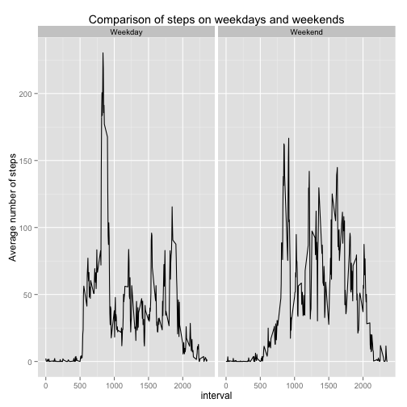

Assumptions: We assume the packages "plyr" and "ggplot2" have been installed before running this code.

## Loading and preprocessing the data

We need to load the data into R, so we pull the data out of the zip file and load it as a csv:

```r
initdata <- read.csv(unz(description = "activity.zip", filename = "activity.csv"))
```

Then we do some processing to calculate the various items we need


```r
library(plyr)
stepsperday <- ddply(initdata, .(date), summarize, steps = sum(steps, na.rm=TRUE))
fivemininterval <- ddply(initdata, .(interval), summarize, meansteps = mean(steps, na.rm=TRUE))
```

## What is mean total number of steps taken per day?

1. Make a histogram of the total number of steps taken each day


```r
hist(stepsperday$steps, main="Number of Steps Taken per Day", xlab="Steps per Day")
```

 

2. Calculate and report the mean and median total number of steps taken per day


```r
meansteps <- mean(stepsperday$steps, na.rm=TRUE)
mediansteps <- median(stepsperday$steps, na.rm=TRUE)
```

The mean number of steps is 9354.23 and the median is 10395.


## What is the average daily activity pattern?

1. Make a time series plot (i.e. type = "l") of the 5-minute interval (x-axis) and the average number of steps taken, averaged across all days (y-axis)


```r
plot(fivemininterval,type="l", xaxt='n', main = "Average Number of Steps Taken Per Hour", xlab = "Hour of Day", ylab = "Number of Steps")
axis(side=1, at=seq(0,2400,by=400))
```

 


2. Which 5-minute interval, on average across all the days in the dataset, contains the maximum number of steps?

```r
whichfive <- fivemininterval[which.max(fivemininterval$meansteps),1]
```

The 5-minute interval with the maximum steps is 835.


## Imputing missing values

Note that there are a number of days/intervals where there are missing values (coded as NA). The presence of missing days may introduce bias into some calculations or summaries of the data.

1. Calculate and report the total number of missing values in the dataset (i.e. the total number of rows with NAs)


```r
countna <-sum(is.na(initdata))
```

The total number of rows with NAs is 2304.

2. Devise a strategy for filling in all of the missing values in the dataset. The strategy does not need to be sophisticated. For example, you could use the mean/median for that day, or the mean for that 5-minute interval, etc.

The chosen strategy is to use the means we previously calculated for each time interval, and replace any records with NAs with that mean.

3. Create a new dataset that is equal to the original dataset but with the missing data filled in.


```r
newdata <- merge(initdata, fivemininterval, by.x="interval", by.y="interval", all=TRUE)
newdata$steps[is.na(newdata$steps)]<-newdata$meansteps[is.na(newdata$steps)]
```

4. Make a histogram of the total number of steps taken each day and Calculate and report the mean and median total number of steps taken per day. Do these values differ from the estimates from the first part of the assignment? What is the impact of imputing missing data on the estimates of the total daily number of steps?


```r
imputedstepsperday <- ddply(newdata, .(date), summarize, steps = sum(steps, na.rm=TRUE))
hist(imputedstepsperday$steps, main="Number of Steps Taken per Day", xlab="Steps per Day")
```

 

```r
imputedmean <- mean(imputedstepsperday$steps, na.rm=TRUE)
imputedmedian <- median(imputedstepsperday$steps, na.rm=TRUE)
```

The mean of the imputed data is 10766.19 and the median is 10766.19.


## Are there differences in activity patterns between weekdays and weekends?

1. Create a new factor variable in the dataset with two levels -- "weekday" and "weekend" indicating whether a given date is a weekday or weekend day.


```r
newdata$day <- ifelse(weekdays(as.Date(newdata$date)) == "Sunday","Weekend",ifelse(weekdays(as.Date(newdata$date)) == "Saturday","Weekend","Weekday"))
```

2. Make a panel plot containing a time series plot (i.e. type = "l") of the 5-minute interval (x-axis) and the average number of steps taken, averaged across all weekday days or weekend days (y-axis).


```r
library(ggplot2)
daysfive <- ddply(newdata, .(interval, day), summarize, meansteps = mean(steps))
qplot(interval, meansteps, data = daysfive, facets = .~day, geom = "line", main = "Comparison of steps on weekdays and weekends", ylab = "Average number of steps")
```

 


